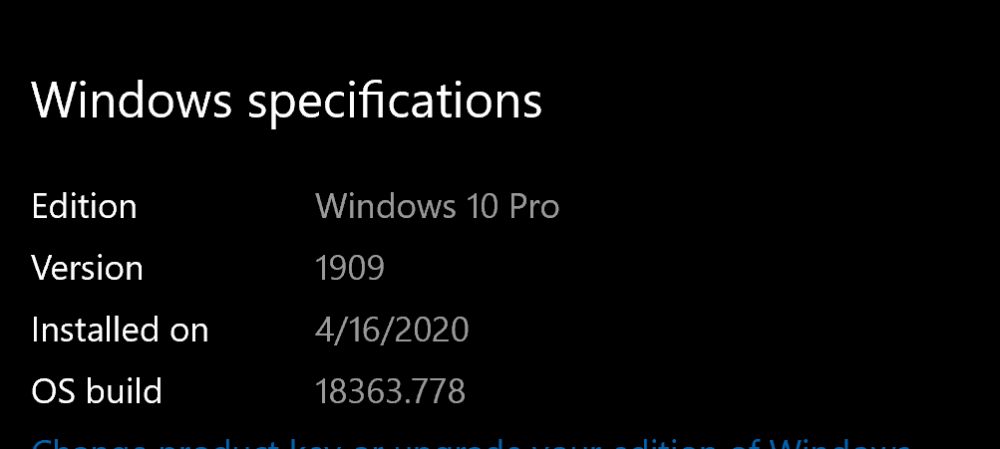
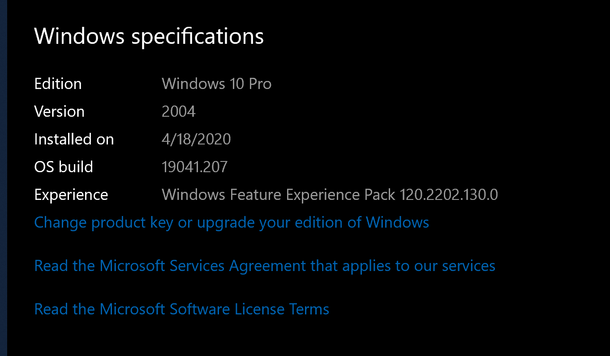

* WSL
    * WSL first - https://docs.microsoft.com/en-us/windows/wsl/install-win10#install-your-linux-distribution-of-choice
    * Install Ubuntu
    * WSL2- https://docs.microsoft.com/en-us/windows/wsl/wsl2-install
    * Setup ssh keys for git 
    * Docker 
      * https://docs.microsoft.com/en-us/windows/wsl/wsl2-kernel

## WSL2 Setup 
Make sure Windows Build is greater than `Windows Build 18917`

In my case it was not: 

Enabling Windows Insider Program to get the latest Windows OS build

After update - 

Then update the linux kernal with WSL 2 - https://docs.microsoft.com/en-us/windows/wsl/wsl2-kernel

To get it to work I had do in Admin PS - 
`wsl --shutdown`

Then after downloading the kernal msi, I right click and Repair/Uninstall. 
And proceeded with installation. 

Then, 

`wsl --set-version ubuntu 2`